# Music 4 U — Tienda Musical

**Proyecto 2 · cc3088 Bases de Datos 1**  
Universidad del Valle de Guatemala · Ciclo 1, 2026  
**Autor:** Diego Andre Calderón Salazar — Carné 241263  

---

## Descripción general

Music 4 U es un sistema de gestión de inventario y ventas para una tienda de discos físicos (vinilos, CDs, cassettes y ediciones limitadas). El proyecto implementa una aplicación web completa con base de datos relacional normalizada en 3FN, backend RESTful con SQL explícito y frontend de página única (SPA).

El sistema soporta dos canales de venta diferenciados:

- **Canal online:** El cliente navega el catálogo, agrega productos al carrito y completa la compra desde su cuenta registrada.
- **Canal presencial:** Un vendedor o administrador registra una venta desde el panel interno, asociándola a un cliente con cuenta (por correo) o a un Consumidor Final (CF) sin cuenta registrada.

---

## Documentación y Diseño

### Informe Técnico
- [Informe de diseño, normalización y diccionario de datos (PDF)](docs/PY2-DB.pdf)

### Modelo Entidad-Relación (DER)
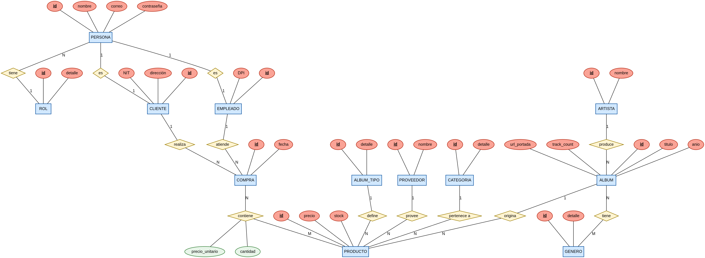

### Modelo Relacional
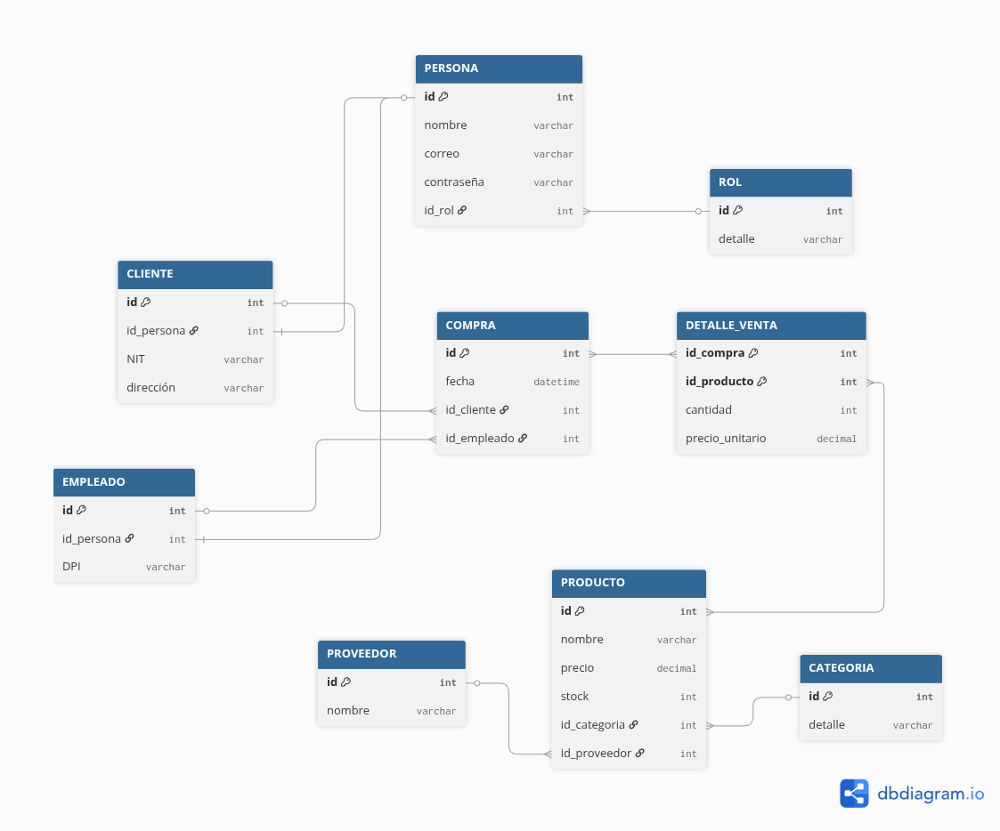

---

## Galería de la Aplicación

### Experiencia del Cliente
| Catálogo (Dark Mode) | Detalle de Álbum |
|:---:|:---:|
| 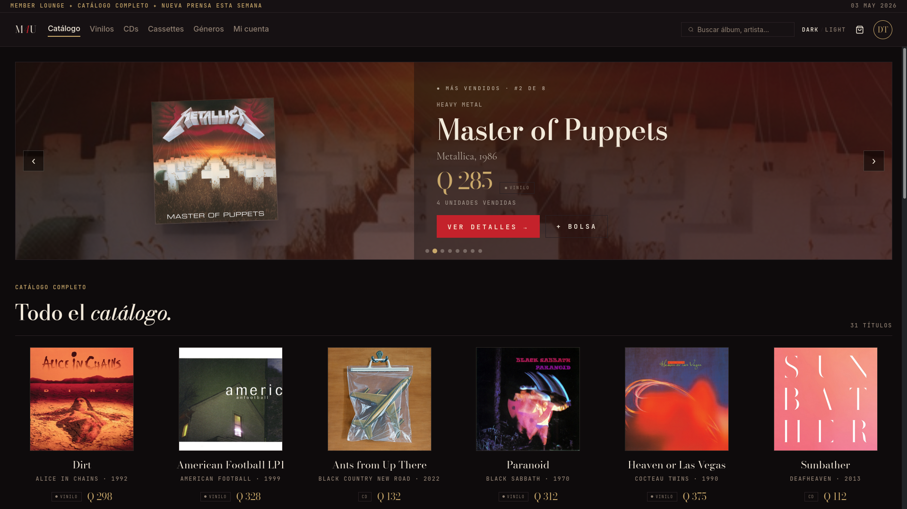 | 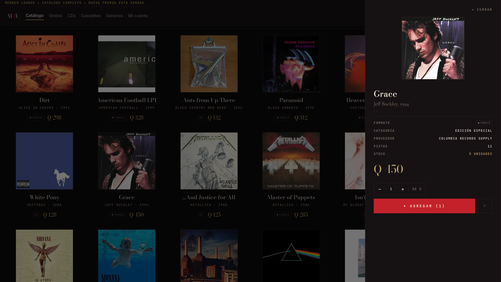 |

| Carrito y Checkout | Historial de Pedidos |
|:---:|:---:|
| 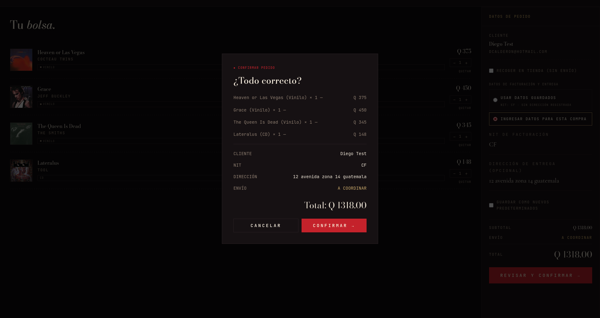 | 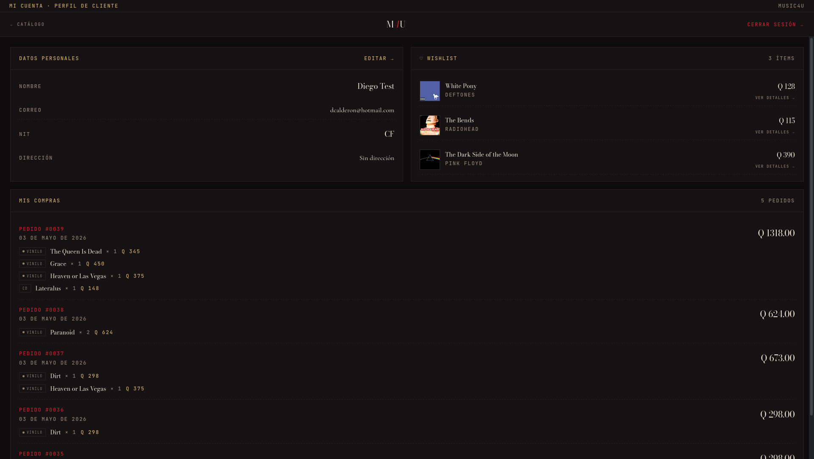 |

### Panel de Administración y Ventas
| Dashboard y KPIs | Gestión de Inventario |
|:---:|:---:|
| 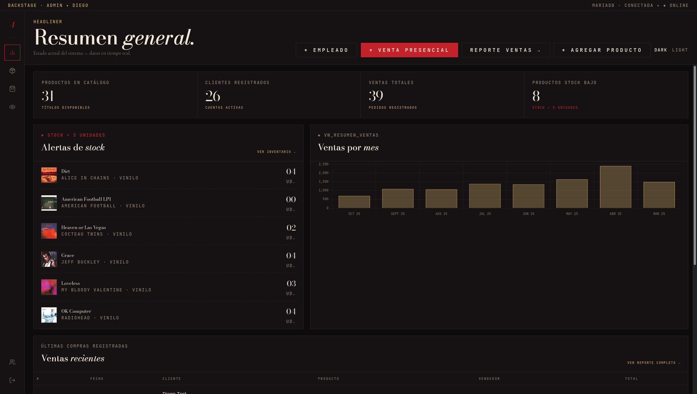 | 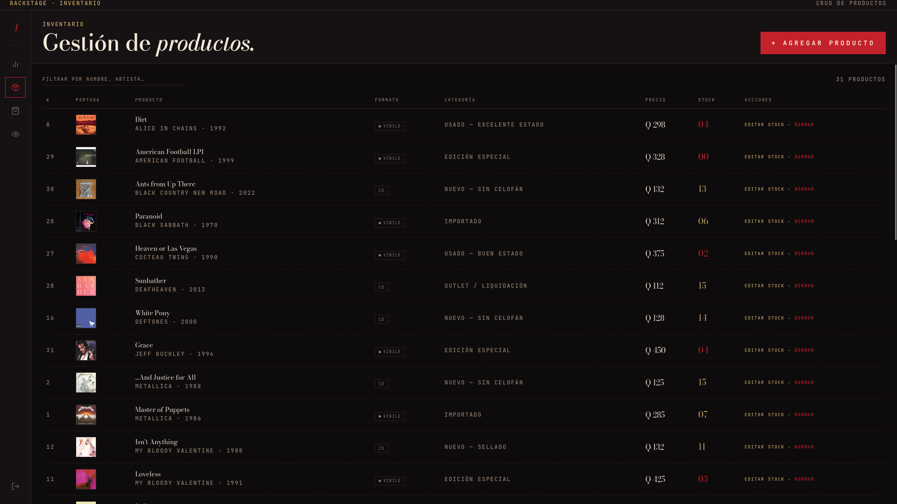 |

| Reporte de Ventas | Detalle de Venta |
|:---:|:---:|
| 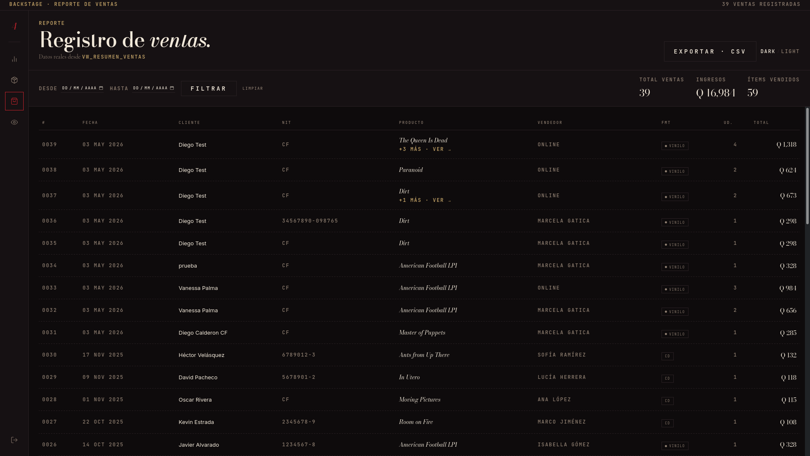 | 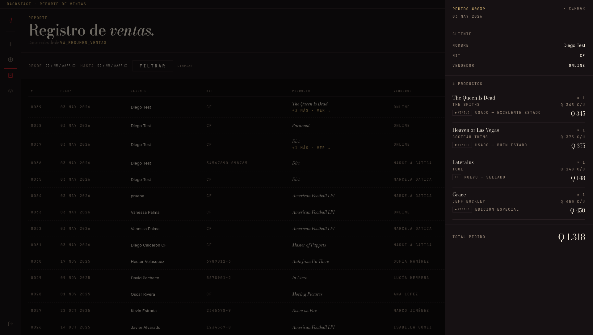 |

| Venta Presencial (POS) | Exportación a CSV |
|:---:|:---:|
| 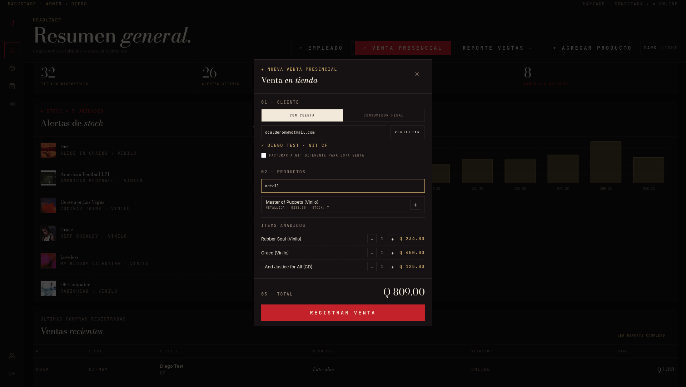 | 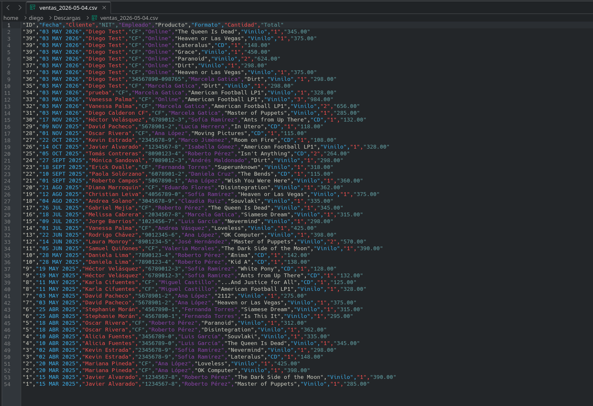 |

### Otros
| Login y Registro | Registro de Staff (Admin) |
|:---:|:---:|
| 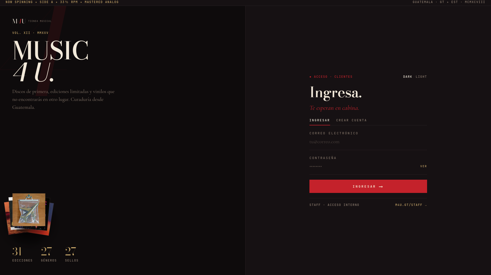 | 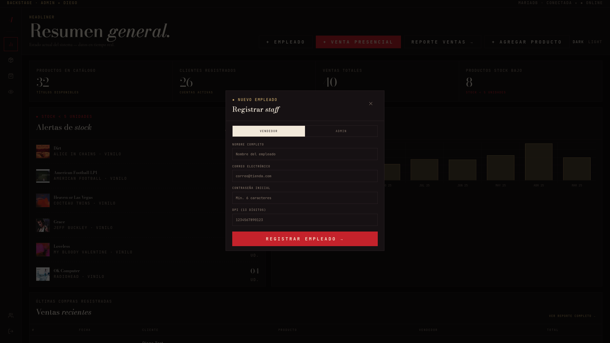 |

| Filtros por Género | Light Mode |
|:---:|:---:|
|  | 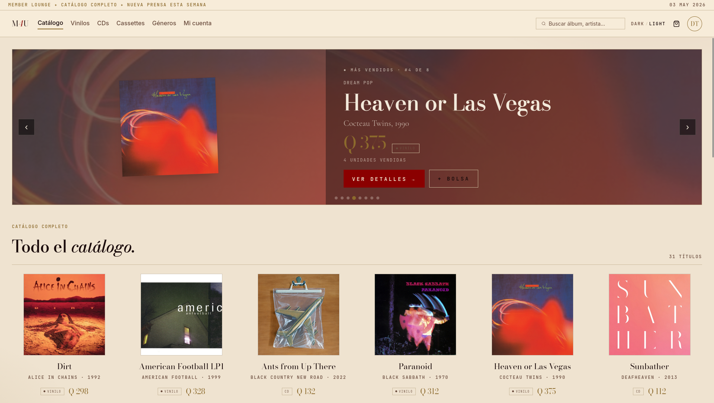 |

| Agregar Producto (iTunes) | Vista Cliente desde Admin |
|:---:|:---:|
| 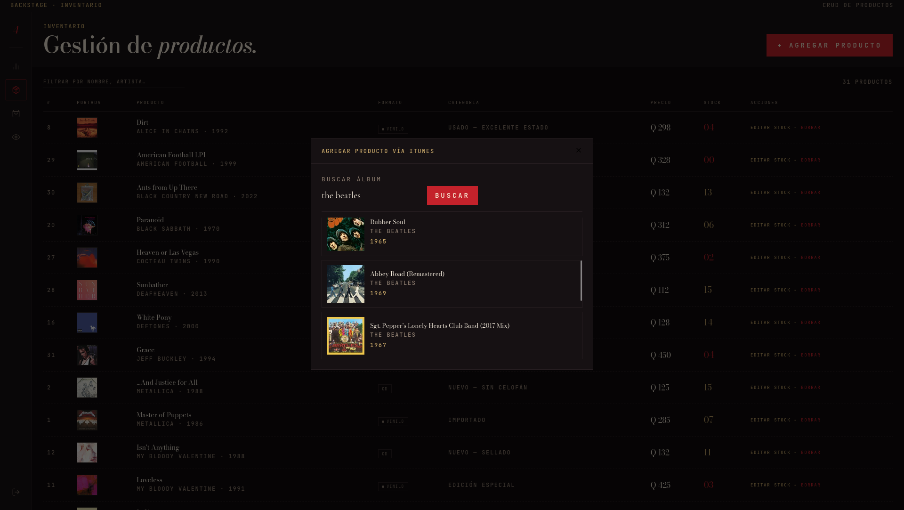 | 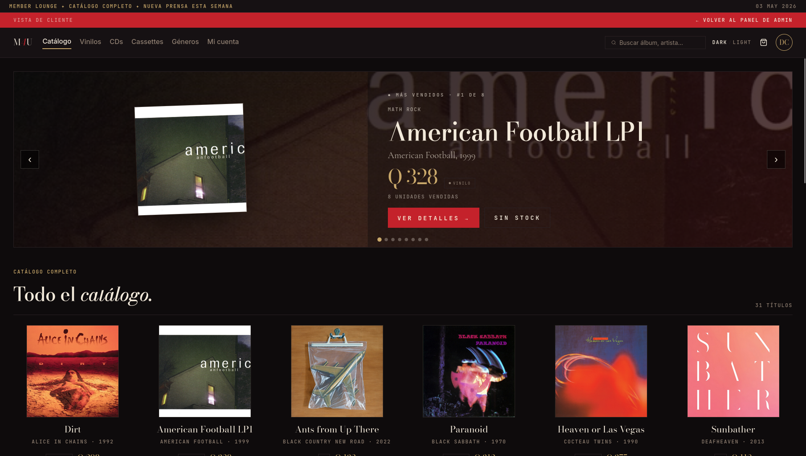 |

---

## Levantamiento del proyecto

### Prerrequisitos

- [Docker Desktop](https://www.docker.com/products/docker-desktop/) o Docker Engine con el plugin Compose
- Git

### Instrucciones (un solo comando)

```bash
# 1. Clonar el repositorio
git clone <url-del-repositorio>
cd Proyecto2-DB

# 2. Copiar el archivo de variables de entorno
cp .env.example .env

# 3. Levantar todos los servicios
docker compose up --build
```

El sistema queda disponible en:

| Servicio   | URL                   |
|------------|-----------------------|
| Aplicación | http://localhost      |
| Adminer    | http://localhost:8080 |
| Backend    | http://localhost:3000 |

> **Nota:** Los scripts de `app/database/init/` se ejecutan automáticamente en el **primer arranque** (volumen vacío), en orden numérico. Si se modifica el esquema, hay que reiniciar con volumen limpio:
> ```bash
> docker compose down -v && docker compose up --build
> ```

### Poblar portadas de álbumes (opcional)

Con los contenedores corriendo, se puede poblar la columna `Album.url_portada` consultando la iTunes Search API:

```bash
docker compose exec backend node scripts/update-covers.js
```

---

## Credenciales de acceso

Todos los usuarios del seed comparten la contraseña **`secret`**.

### Administrador

| Campo      | Valor                              |
|------------|------------------------------------|
| Correo     | `diego.admin@tiendamusical.gt`     |
| Contraseña | `secret`                           |

**Permisos:** Acceso completo al sistema. Puede gestionar inventario, consultar reportes de ventas, registrar ventas presenciales y **registrar nuevos empleados** (vendedores y administradores). Es el único rol que puede eliminar registros de productos y crear cuentas de staff.

Otros administradores en el seed: `marce.admin@tiendamusical.gt`, `max.admin@tiendamusical.gt`.

---

### Vendedor

| Campo      | Valor                              |
|------------|------------------------------------|
| Correo     | `marcela.gatica@tiendamusical.gt`       |
| Contraseña | `secret`                           |

**Permisos:** Puede registrar ventas presenciales, gestionar inventario (agregar productos, editar precio y stock) y consultar el reporte de ventas completo con exportación a CSV. No puede registrar empleados ni eliminar registros de productos.

Otros vendedores en el seed: `roberto.perez@tiendamusical.gt`, `sofia.ramirez@tiendamusical.gt`, `luis.garcia@tiendamusical.gt`.

---

### Cliente

| Campo      | Valor                              |
|------------|------------------------------------|
| Correo     | `javier.alvarado@gmail.com`        |
| Contraseña | `secret`                           |

**Permisos:** Navegar el catálogo, agregar productos al carrito, realizar compras online, administrar su wishlist y consultar su historial de pedidos.

Otros clientes en el seed: `mariana.pineda@gmail.com`, `kevin.estrada@hotmail.com`, `alicia.fuentes@gmail.com`.

> También se puede registrar un cliente nuevo desde la pantalla de login usando la pestaña **CREAR CUENTA**.

---

## Variables de entorno

El archivo `.env.example` contiene todas las variables requeridas. Los valores de `DB_USER` y `DB_PASSWORD` están fijados para calificación y **no deben modificarse**:

```env
DB_USER=proy2
DB_PASSWORD=secret
DB_NAME=tienda_db
DB_ROOT_PASSWORD=rootsecret
DB_PORT=3306
BACKEND_PORT=3000
FRONTEND_PORT=80
JWT_SECRET=supersecretjwt
```

---

## Stack tecnológico

| Capa       | Tecnología                                              |
|------------|---------------------------------------------------------|
| Base datos | MariaDB 11.4                                            |
| Backend    | Fastify 5 + Node.js 22 · SQL explícito, sin ORM         |
| Frontend   | Vue 3 (Composition API) · Vite · Pinia · PrimeVue · Chart.js |
| Auth       | JSON Web Tokens (JWT) · bcryptjs (cost 12)              |
| Deploy     | Docker Compose (único punto de entrada)                 |

---

## Arquitectura del proyecto

```
Proyecto2-DB/
├── app/
│   ├── database/
│   │   └── init/
│   │       ├── 01_schema.sql        # DDL: tablas, índices, vista
│   │       └── 02_data.sql          # Seed: ≥25 filas por tabla principal
│   ├── backend/
│   │   └── src/
│   │       ├── routes/
│   │       │   ├── auth.js          # Login, registro, /me
│   │       │   ├── ventas.js        # Venta online, presencial, reporte, mis-compras
│   │       │   ├── productos.js     # CRUD productos, más vendidos
│   │       │   ├── albums.js        # Álbumes, búsqueda iTunes
│   │       │   ├── clientes.js      # Perfil cliente, empleados, admin endpoints
│   │       │   ├── catalogos.js     # Categorías, géneros, proveedores, album-tipos
│   │       │   └── stats.js         # KPIs públicos
│   │       ├── hooks/
│   │       │   ├── authenticate.js  # Middleware JWT
│   │       │   └── authorize.js     # Middleware de roles
│   │       └── db.js                # Pool de conexiones mysql2
│   └── frontend/
│       └── src/
│           ├── views/
│           │   ├── LoginView.vue
│           │   ├── CatalogView.vue
│           │   ├── CartView.vue
│           │   ├── ProfileView.vue
│           │   ├── AdminView.vue
│           │   ├── InventarioView.vue
│           │   ├── VentasView.vue
│           │   └── NotFoundView.vue
│           ├── components/
│           │   ├── FeaturedCarousel.vue
│           │   ├── AlbumCard.vue
│           │   ├── AlbumCover.vue
│           │   ├── FormatChip.vue
│           │   └── …
│           ├── stores/
│           │   ├── auth.js          # JWT, login/logout, carga wishlist por usuario
│           │   ├── cart.js          # Carrito en memoria
│           │   └── wishlist.js      # Wishlist en localStorage por usuario
│           ├── router/index.js      # Guards por rol, ruta 404
│           └── api/index.js         # Axios con interceptor JWT y auto-logout
├── docker-compose.yml
├── docker-compose.example.yml
├── .env                             # No commiteado
└── .env.example                     # Commiteado — lista todas las variables
```

---

## Esquema de base de datos

Base de datos: `tienda_db` · MariaDB 11.4 · **Normalizada en 3FN**

```
Rol          (id PK, detalle)
Categoria    (id PK, detalle UNIQUE)      — etiqueta comercial del producto físico
Proveedor    (id PK, nombre UNIQUE)
Artista      (id PK, nombre UNIQUE)
Album_Tipo   (id PK, detalle UNIQUE)      — Vinilo | CD | Cassette | Edición Limitada
Genero       (id PK, detalle UNIQUE)      — clasificación musical del álbum
Persona      (id PK, nombre, correo UNIQUE, contrasena, id_rol FK)
Empleado     (id PK, id_persona FK UNIQUE, DPI UNIQUE VARCHAR(13))
Cliente      (id PK, id_persona FK UNIQUE, NIT, direccion NULL)
Album        (id PK, titulo, anio YEAR, url_portada VARCHAR(1024) NULL,
              track_count, id_artista FK)
Album_Genero (id_album FK, id_genero FK — PK compuesta)    — N:M
Producto     (id PK, precio DECIMAL(10,2), stock UNSIGNED,
              id_album FK, id_album_tipo FK, id_categoria FK, id_proveedor FK,
              UNIQUE(id_album, id_album_tipo))
Compra       (id PK, id_cliente FK NULL, id_empleado FK NULL,
              nombre_cf VARCHAR(200) NULL, nit_cf VARCHAR(20) NULL,
              fecha DATETIME DEFAULT NOW)
DetalleVenta (id_compra FK, id_producto FK — PK compuesta,
              cantidad, precio_unitario DECIMAL(10,2))
```

### Índices explícitos

| Índice                  | Tabla    | Justificación                                               |
|-------------------------|----------|-------------------------------------------------------------|
| `idx_compra_fecha`      | Compra   | Filtrado eficiente por rango de fechas en el reporte        |
| `idx_album_titulo`      | Album    | Búsqueda y autocompletado en la UI de inventario            |
| `idx_album_id_artista`  | Album    | Listado de discografía por artista sin full scan            |
| `idx_producto_stock`    | Producto | Consultas de stock bajo (`WHERE stock < 5`) en el dashboard |
| `idx_cliente_NIT`       | Cliente  | Búsqueda por NIT para facturación (no UNIQUE porque "CF" se repite) |

### Vista: `vw_resumen_ventas`

Consolida en una sola vista el JOIN de 10 tablas: `Compra`, `Cliente`, `Persona` (cliente), `Empleado`, `Persona` (empleado), `DetalleVenta`, `Producto`, `Album`, `Artista`, `Album_Tipo` y `Categoria`.

Es consumida por:
- `GET /api/ventas` — reporte completo de ventas
- `GET /api/ventas/mis-compras` — historial del cliente autenticado
- `POST /api/ventas` y `POST /api/ventas/presencial` — recibo inmediato tras registrar una venta

---

## Solución para ventas presenciales y ventas online simultáneas

### Problema de diseño

El canal online requiere un `id_cliente` porque la compra está ligada a la sesión JWT del usuario. Sin embargo, en el canal presencial el vendedor atiende a clientes que pueden no tener cuenta en el sistema (Consumidor Final). El esquema original declaraba `id_cliente NOT NULL`, lo que hacía imposible registrar ventas CF.

### Modificaciones al DDL

Se realizaron dos modificaciones en la tabla `Compra`:

**1. `id_cliente` ahora es nullable:**
```sql
-- Antes
id_cliente  INT UNSIGNED NOT NULL

-- Después
id_cliente  INT UNSIGNED NULL   -- NULL indica venta presencial a CF
```

**2. Nuevas columnas para datos del comprador CF:**
```sql
nombre_cf   VARCHAR(200) NULL,  -- Nombre del Consumidor Final
nit_cf      VARCHAR(20)  NULL   -- NIT (o "CF") para la factura
```

La regla de negocio que garantiza coherencia se aplica en el backend: el endpoint valida que llegue `correo` (cliente con cuenta) **o** `nombre_cf` (CF), y retorna 400 si ninguno está presente.

**3. Actualización de `vw_resumen_ventas`:**

Los JOINs hacia `Cliente` y `Persona` se cambiaron de `JOIN` a `LEFT JOIN` para incluir también las ventas CF (donde `id_cliente IS NULL`). Los campos de nombre y NIT usan `COALESCE` para combinar ambas fuentes:

```sql
LEFT JOIN   Cliente      cli     ON c.id_cliente   = cli.id
LEFT JOIN   Persona      pe_cli  ON cli.id_persona = pe_cli.id
...
COALESCE(pe_cli.nombre, c.nombre_cf) AS nombre_cliente,
COALESCE(c.nit_cf,      cli.NIT)     AS nit_cliente
```

El orden del `COALESCE` en el NIT (`nit_cf` primero) es intencional: permite que un cliente con cuenta solicite facturar a un NIT diferente en una compra específica (por ejemplo, a nombre de una empresa), sin modificar el NIT guardado en su perfil.

### Flujo de venta presencial (paso a paso)

1. El vendedor o administrador hace clic en **"+ VENTA PRESENCIAL"** en el dashboard (`/admin`).
2. Selecciona el tipo de cliente:
   - **Con cuenta:** ingresa el correo y hace clic en VERIFICAR. El sistema consulta `GET /api/admin/buscar-cliente` y confirma el nombre y NIT. Opcionalmente se puede activar **"Facturar a NIT diferente"** para esa venta.
   - **Consumidor Final:** ingresa nombre y NIT manualmente (o deja "CF").
3. Agrega uno o más productos con sus cantidades usando el buscador integrado.
4. Hace clic en **REGISTRAR VENTA**. El backend ejecuta:
   ```
   BEGIN
     INSERT INTO Compra (id_cliente, id_empleado, nombre_cf, nit_cf)
     FOR EACH item:
       SELECT precio, stock FROM Producto WHERE id = ? FOR UPDATE
       -- valida stock
       INSERT INTO DetalleVenta (id_compra, id_producto, cantidad, precio_unitario)
       UPDATE Producto SET stock = stock - ? WHERE id = ?
   COMMIT   ← o ROLLBACK si algún paso falla
   ```
5. Se muestra un recibo con número de pedido, cliente, ítems y total.

---

## Funcionalidades por rol

### Vista del cliente (`/`)

- **Carrusel de más vendidos:** Sección principal con los álbumes de mayor volumen de ventas, ordenados por `SUM(dv.cantidad)` desde `DetalleVenta`. Avance automático cada 4 segundos, navegación manual con flechas y dots. Justificación visible: "N UNIDADES VENDIDAS".
- **Filtros:** Por formato (Vinilo, CD, Cassette), por género (27 géneros musicales) y búsqueda por título o artista con debounce de 300 ms (sin llamadas extra al backend).
- **Panel de detalle:** Slide-in lateral al hacer clic en cualquier álbum. Muestra géneros, formato, categoría, proveedor, pistas, stock, precio. Incluye selector de cantidad `[−] N [+]` antes de agregar al carrito.
- **Carrito (`/carrito`):** Lista de ítems con controles de cantidad. Sección de checkout con dos opciones diferenciadas: **"Usar datos guardados"** (NIT y dirección del perfil, solo lectura) o **"Ingresar datos para esta compra"** (editable, con opción de guardar como predeterminados). Modal de confirmación con resumen completo antes de procesar el pago.
- **Perfil (`/perfil`):** Edición de NIT y dirección. Wishlist personal (clickeable: cada ítem abre el panel de detalle con opción de agregar al carrito o quitar). Historial completo de compras con detalle de cada producto, cantidad y subtotal.
- **Wishlist persistente:** Almacenada en `localStorage` con clave `wishlist_{userId}`, lo que aísla los favoritos de cada usuario aunque compartan el mismo navegador.

### Panel de administrador y vendedor (`/admin`)

- **Dashboard:** KPIs en tiempo real (productos en catálogo, clientes registrados, ventas totales, alertas de stock). Gráfica de barras con ingresos por mes calculados desde `vw_resumen_ventas`. Tabla de ventas recientes. Lista de productos con stock crítico (<5 unidades).
- **Venta presencial:** Detallada en la sección anterior.
- **Vista del catálogo cliente:** Enlace en el rail lateral para navegar al catálogo como si se fuera cliente. Se muestra una barra roja de aviso con botón de regreso al panel de admin.

### Inventario (`/admin/inventario`)

- Tabla de todos los productos con edición inline de precio y stock (PATCH `/api/productos/:id`).
- Botón **STOCK −**: abre modal para reducir N unidades del stock sin eliminar el registro.
- Botón **BORRAR**: elimina el registro completo del producto. Solo disponible para el rol `admin`. Falla con error descriptivo si el producto tiene ventas registradas (integridad referencial).
- Modal **"+ AGREGAR PRODUCTO"**: búsqueda en la iTunes Search API por título o artista. Al seleccionar un resultado, el formulario se pre-llena con portada, título, artista y año. Si el álbum o artista ya existen, el backend los reutiliza (maneja el HTTP 409 con el `id` existente). Alternativa: ingresar los datos del álbum manualmente con URL de portada externa.

### Reporte de ventas (`/admin/ventas`)

- Tabla completa desde `vw_resumen_ventas` con todas las compras del sistema.
- Filtro por rango de fechas (usa el índice `idx_compra_fecha`).
- KPIs del período: total de pedidos, ingresos totales, ítems vendidos.
- **Panel de detalle por venta:** Al hacer clic en cualquier fila se despliega un panel lateral con todos los productos de esa compra (artista, formato, categoría, cantidad, precio unitario, subtotal) y el total del pedido.
- **Exportar a CSV:** Genera archivo con BOM UTF-8 (compatibilidad con Excel en español). Una fila por ítem de venta, con columnas: ID, Fecha, Cliente, NIT, Empleado, Producto, Formato, Cantidad, Total.

### Registro de empleados (solo admin)

- Botón **"+ EMPLEADO"** visible únicamente para el rol `admin`.
- Modal con selección de rol (Vendedor / Admin) y campos: nombre, correo, contraseña y DPI (13 dígitos numéricos).
- El backend valida unicidad de correo y DPI antes de proceder.
- Transacción explícita: `INSERT Persona + INSERT Empleado` con `ROLLBACK` si alguno falla.
- Contraseña encriptada con bcrypt (cost 12).

---

## Cumplimiento de la rúbrica

### I. Diseño de base de datos — 40 pts

| Criterio | Estado | Evidencia |
|----------|--------|-----------|
| Diagrama ER: entidades, atributos, relaciones y cardinalidades | ✓ | `DER-PY2.png` |
| Modelo relacional documentado | ✓ | `modelo-relacional.png` + PDF |
| Normalización hasta 3FN con dependencias funcionales | ✓ | `PY2-DB.pdf` |
| DDL completo con PRIMARY KEY, FOREIGN KEY y NOT NULL | ✓ | `app/database/init/01_schema.sql` |
| Datos de prueba realistas con ≥25 registros por tabla | ✓ | `app/database/init/02_data.sql` |
| Índices explícitos (`CREATE INDEX`) en ≥2 columnas justificadas | ✓ | 5 índices con comentarios en `01_schema.sql` |

### II. SQL — 50 pts

Todas las consultas se ejecutan desde la aplicación web y son visibles en la interfaz de usuario.

| Criterio | Implementación en el código |
|----------|-----------------------------|
| **3 consultas con JOIN entre múltiples tablas** | `GET /api/productos`: JOIN de 6 tablas (Producto, Album, Artista, Album_Tipo, Categoria, Proveedor) con subquery de géneros. `GET /api/ventas`: JOIN sobre `vw_resumen_ventas` (10 tablas). `GET /api/productos/mas-vendidos`: JOIN adicional con `DetalleVenta` para calcular unidades vendidas. |
| **2 consultas con subquery** | Subquery correlacionada `SELECT GROUP_CONCAT(g.detalle ...) WHERE ag.id_album = p.id_album` en `SQL_PRODUCTO`. Subquery `EXISTS` en las validaciones de FK de `POST /api/productos`. |
| **GROUP BY, HAVING y funciones de agregación** | `GET /api/ventas`: CTE con `SUM(cantidad * precio_unitario) AS total` y `COUNT(DISTINCT id_producto) AS num_productos` agrupado por `id_compra`. `GET /api/productos/mas-vendidos`: `SUM(dv.cantidad) AS total_vendido ... GROUP BY p.id ORDER BY total_vendido DESC`. |
| **Al menos 1 CTE (`WITH`)** | `GET /api/ventas` usa `WITH totales_compra AS (SELECT id_compra, SUM(...) AS total, COUNT(DISTINCT ...) AS num_productos FROM DetalleVenta GROUP BY id_compra)` antes del SELECT principal. |
| **Al menos 1 VIEW usado por el backend** | `CREATE OR REPLACE VIEW vw_resumen_ventas` — utilizada en el reporte de ventas, el historial del cliente y el recibo de compra. |
| **Transacción explícita con ROLLBACK** | `POST /api/ventas`, `POST /api/ventas/presencial`, `POST /api/auth/register` y `POST /api/admin/empleados` usan `conn.beginTransaction()` / `conn.commit()` / `conn.rollback()` explícitos con control de errores. |

### III. Aplicación web — 35 pts

| Criterio | Implementación |
|----------|---------------|
| **CRUD completo de ≥2 entidades** | **Producto:** crear (modal con búsqueda iTunes o entrada manual), leer (tabla en `/admin/inventario`), actualizar precio y stock (PATCH inline), eliminar registro (DELETE). **Cliente/Perfil:** leer (sección "DATOS PERSONALES" en `/perfil`), actualizar NIT y dirección (PATCH `/api/clientes/mi-perfil`). |
| **Reporte en UI con datos reales de la DB** | `/admin/ventas`: tabla completa desde `vw_resumen_ventas` con filtro de fechas, KPIs calculados en la DB y panel de detalle expandible por venta. |
| **Manejo visible de errores** | Mensajes de error en login (credenciales incorrectas), registro (correo duplicado), checkout (stock insuficiente), inventario (FK violada al eliminar) y todos los modales. El interceptor de Axios maneja el 401 diferenciando sesión expirada de intento de login fallido. |
| **README con instrucciones funcionales** | Este documento. |

### IV. Avanzado — 15 pts

| Criterio | Implementación |
|----------|---------------|
| **Autenticación con login/logout y sesión** | JWT firmado con `@fastify/jwt`. Token en `localStorage`, enviado en cada request como `Authorization: Bearer`. Guards en el router Vue por rol. Auto-logout al recibir 401 con token activo. La wishlist se carga y limpia por usuario al hacer login/logout. |
| **Exportar reporte a CSV** | Botón "EXPORTAR · CSV" en `/admin/ventas`. Genera `Blob` con BOM UTF-8 (`''`), aplana todos los ítems de ventas y descarga el archivo con nombre `ventas_YYYY-MM-DD.csv`. |

---

## Endpoints del backend

### Autenticación

| Método | Ruta | Acceso | Descripción |
|--------|------|--------|-------------|
| POST | `/api/auth/login` | Público | Genera JWT |
| POST | `/api/auth/register` | Público | Crea cuenta de cliente (transacción) |
| GET | `/api/auth/me` | Autenticado | Datos del token actual |

### Productos y álbumes

| Método | Ruta | Acceso | Descripción |
|--------|------|--------|-------------|
| GET | `/api/productos` | Público | Lista completa con JOINs |
| GET | `/api/productos/mas-vendidos` | Público | Top N por `SUM(cantidad)` |
| POST | `/api/productos` | Staff | Crear producto (validación de FKs) |
| PATCH | `/api/productos/:id` | Staff | Actualizar precio y/o stock |
| DELETE | `/api/productos/:id` | Admin | Eliminar registro |
| GET | `/api/albums` | Público | Lista de álbumes |
| POST | `/api/albums` | Staff | Crear álbum y artista si no existen |
| GET | `/api/albums/buscar-portada` | Staff | Búsqueda en iTunes Search API |

### Ventas

| Método | Ruta | Acceso | Descripción |
|--------|------|--------|-------------|
| POST | `/api/ventas` | Autenticado | Venta online o en tienda con `id_cliente` |
| POST | `/api/ventas/presencial` | Staff | Venta presencial (CF o cliente por correo) |
| GET | `/api/ventas` | Staff | Reporte completo (CTE + vista) |
| GET | `/api/ventas/mis-compras` | Autenticado | Historial del cliente autenticado |

### Clientes y empleados

| Método | Ruta | Acceso | Descripción |
|--------|------|--------|-------------|
| GET | `/api/clientes/mi-perfil` | Autenticado | Perfil del cliente |
| PATCH | `/api/clientes/mi-perfil` | Autenticado | Actualizar NIT y dirección |
| GET | `/api/admin/clientes` | Staff | Lista de clientes |
| GET | `/api/admin/buscar-cliente?correo=` | Staff | Verificar cliente por correo |
| GET | `/api/admin/empleados` | Staff | Lista de empleados |
| POST | `/api/admin/empleados` | Admin | Registrar empleado (transacción) |

### Utilidades

| Método | Ruta | Acceso | Descripción |
|--------|------|--------|-------------|
| GET | `/api/stats/publico` | Público | KPIs para la pantalla de login |
| GET | `/api/health-db` | Público | Conectividad con la DB |
| GET | `/api/categorias` | Público | Categorías comerciales |
| GET | `/api/generos` | Público | Géneros musicales |
| GET | `/api/proveedores` | Staff | Distribuidoras |
| GET | `/api/album-tipos` | Público | Formatos físicos |

---

## Mapa de pantallas

| Ruta | Vista | Acceso |
|------|-------|--------|
| `/login` | Login y registro | Público |
| `/` | Catálogo + carrusel + panel de detalle | Todos los roles autenticados |
| `/carrito` | Carrito + checkout + confirmación | Autenticado |
| `/perfil` | Perfil, wishlist, historial de compras | Autenticado |
| `/admin` | Dashboard (KPIs, gráfica, ventas recientes) | Admin, Vendedor |
| `/admin/inventario` | CRUD de productos | Admin, Vendedor |
| `/admin/ventas` | Reporte de ventas + CSV | Admin, Vendedor |
| `/*` | Página 404 | Cualquier ruta inválida |

---

## Verificación de la base de datos

**Adminer** (http://localhost:8080) permite inspeccionar la DB directamente:

- Servidor: `db`
- Usuario: `proy2`
- Contraseña: `secret`
- Base de datos: `tienda_db`

**Health check del backend:** http://localhost:3000/api/health-db — confirma conectividad en tiempo real ejecutando `SELECT 1`.
